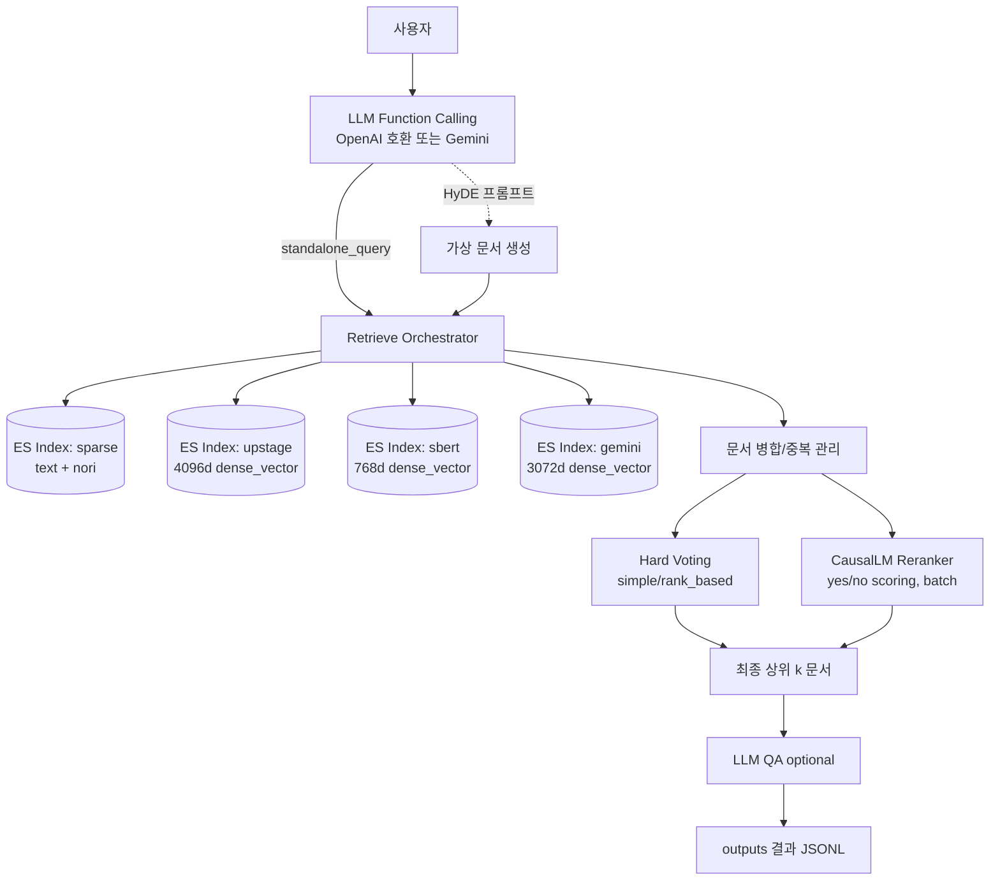

# Information Retrieval 경진대회 - 과학 지식 질의 응답 시스템 구축
## Team 4조

|  |  |  |  |  |
| :--------------------------------------------------------------: | :--------------------------------------------------------------: | :--------------------------------------------------------------: | :--------------------------------------------------------------: | :--------------------------------------------------------------: |
|            [류지헌](https://github.com/mahomi)             |            [김태현](https://github.com/huefilm)             |            [박진섭](https://github.com/seob1504)             |            [문진숙](https://github.com/June3723)             |            [김재덕](https://github.com/ttcoaster)             |
|                   팀장, RAG 아키텍처 설계<br/>RAG 파이프라인 구현                   |                   문서 전처리 및 분할<br/>검색 최적화                   |                   임베딩 및 벡터 저장소<br/>성능 튜닝                   |                   프롬프트 엔지니어링<br/>답변 품질 개선                   |                   API 통합 및 배포<br/>환경 설정 관리                   |

## 0. Overview
### Environment
- OS: Linux/Mac (테스트: Ubuntu 20.04/22.04, macOS 14+)
- Python: 3.10+

### Requirements
- Python 패키지: `uv`(권장)
- Elasticsearch 9.x 권장(8.x도 일부 스크립트 제공)
- 모델/키: OpenAI 호환 API(upstage 포함) 또는 Gemini API, Sentence-Transformers

## 1. Competiton Info

### Overview

- 과학 지식 질의 응답 시스템 구축: 질문과 이전 대화 히스토리를 바탕으로 검색엔진에서 관련 문서를 추출하고, 이를 활용해 적합한 답변을 생성하는 RAG 태스크입니다.

### Timeline

- 2025-09-08 10:00 대회 시작
- 2025-09-18 19:00 최종 마감

## 2. Components

### Directory

```
├── code                              # 프로젝트 소스 디렉터리
│   ├── baseline                      # 베이스라인 RAG + Elasticsearch 구현
│   │   ├── rag_with_elasticsearch.py # 베이스라인 실행 스크립트
│   │   ├── install_elasticsearch.sh  # Elasticsearch 8.x 설치 스크립트
│   │   ├── install_elasticsearch_9.0.3.sh # Elasticsearch 9.x 설치 스크립트
│   │   ├── start_elasticsearch.sh    # Elasticsearch 시작 스크립트
│   │   ├── stop_elasticsearch.sh     # Elasticsearch 종료 스크립트
│   │   ├── env_template.txt          # .env 템플릿(ES/LLM 키)
│   │   ├── README.md                 # 베이스라인 사용 가이드
│   │   └── sample_submission*.csv    # 제출 포맷 샘플 파일들
│   ├── eval                          # 평가 유틸리티 및 결과 모음
│   │   ├── reranker_eval.py          # 내부 평가 스크립트
│   ├── mentoring                     # 멘토링 예제/스크립트/산출물
│   │   ├── biencoder.py              # 바이인코더 실험 코드
│   │   ├── reranker.py               # 리랭커 스크립트
│   │   ├── reranker2.py              # 리랭커 변형 스크립트
│   │   ├── run_biencoder.sh          # 바이인코더 실행 스크립트
│   │   ├── run_reranker.sh           # 리랭커 실행 스크립트
│   │   ├── run_reranker2.sh          # 리랭커 v2 실행 스크립트
│   │   └── ...                        # 기타 산출물/로그
│   ├── rag_with_hydra_reranker       # 하이브리드 검색 + 리랭커 파이프라인
│   │   ├── rag_with_hybrid_reranker_es8.py  # ES 8.x 실행 스크립트
│   │   ├── rag_with_hybrid_reranker_es9.py  # ES 9.x 실행 스크립트
│   │   ├── rag_with_hybrid_reranker_es9_voting.py # 투표 앙상블 실행
│   │   ├── reranker_usage.py         # reranker 공식 사용 예시 스크립트
│   │   ├── run.sh                    # 복수 실험 실행 스크립트
│   │   ├── env_template.txt          # .env 템플릿(ES/LLM 키)
│   │   ├── README_gemini_embeddings.md # Gemini 임베딩 가이드
│   │   ├── conf/...                  # Hydra 설정 모음
│   │   ├── tools/...                 # 보조 도구 스크립트
│   │   ├── utils/...                 # 캐시/유틸리티
│   │   ├── outputs/...               # 실험 로그 및 결과
│   │   ├── cache/...                 # LLM/임베딩 캐시
│   │   └── gemini_embeddings/...     # 사전 생성된 임베딩 파일
│   ├── hard_voting.py                # 단순 하드 보팅 스크립트
│   ├── hard_voting_weight.py         # 가중 하드 보팅 스크립트
│   └── hard_voting_weight2.py        # 가중 하드 보팅 스크립트 v2
├── docs                              # 문서 디렉터리
├── input                             # 데이터 디렉터리
│   └── data                          # 입력 데이터
│       ├── documents.jsonl           # 문서 코퍼스
│       └── eval.jsonl                # 평가 질의 세트
├── scripts                           # 보조 스크립트
│   ├── enable_flash_attn_env.sh      # FlashAttention 환경 설정
│   └── python_glibc32_wrapper.sh     # glibc 2.32 파이썬 래퍼
├── AGENTS.md                         # 에이전트 관련 문서
├── pyproject.toml                    # Python/uv 패키지 설정
├── uv.lock                           # uv 잠금 파일
└── README.md                         # 프로젝트 개요 및 사용법
```

### 시스템 아키텍처




### 하이브리드 RAG(Hydra + Voting/Reranker) 실행

최신 파이프라인은 `code/rag_with_hydra_reranker/rag_with_hybrid_reranker_es9_voting.py` 입니다. Elasticsearch 9.x, 한국어 `nori`, 멀티 인덱스(역색인 + 여러 dense 백엔드), HyDE, 하드보팅/리랭커, LLM/임베딩 캐시를 지원합니다.

```bash
# 환경 준비
pip install uv  # UV 설치

# Elasticsearch 설치 (아직 설치 안한 경우만 설치)
./install_elasticsearch_9.0.3.sh  # code/baseline에 위치, 9.x 설치 스크립트
# "Please confirm that you would like to continue"에서 y 입력하고, 출력되는 비빌번호를 .env에 입력할것.

cd code/rag_with_hydra_reranker
cp env_template.txt .env   # .env 생성하고 ES/LLM 키 입력

# 평가 실행(기본 설정 사용)
source scripts/enable_flash_attn_env.sh # flash attention 환경 활성화 (uv run 전에 실행)
uv run python rag_with_hybrid_reranker_es9_voting.py

# Hydra 구성 오버라이드 예시
uv run python rag_with_hybrid_reranker_es9_voting.py \
  retrieve.sparse.enabled=true \
  retrieve.dense_upstage.enabled=true \
  retrieve.dense_sbert.enabled=false \
  retrieve.dense_upstage_hyde.enabled=true \
  retrieve.dense_gemini.enabled=false \
  retrieve.dense_gemini_hyde.enabled=false \
  reranker.use_hard_voting=true reranker.hard_voting.mode=rank_based \
  dense.mode=ann dense.metric=cosine
```

실행 시 주요 동작
- 인덱스 분리 생성/재사용: `sparse`(역색인), `upstage`(4096d), `sbert`(768d), `gemini`(3072d)
  - 공통: 한국어 `nori` 분석기, `dense_vector`는 ES KNN 또는 script_score로 검색
  - `index.force_recreate=true` 시 활성화된 인덱스만 재생성 및 색인
- Retrieve 조합: Sparse + Upstage + SBERT + Upstage-HyDE + Gemini + Gemini-HyDE 중 설정된 것만 병합
  - ANN(knn) 또는 Exact(script_score) 모드 선택: `dense.mode=ann|exact`, metric: `cosine|dot|l2`
  - Query Embedding 캐시 지원: `utils/query_embedding_cache.py`
- 하드 보팅 또는 리랭커
  - Hard voting: `reranker.use_hard_voting=true`
    - `mode=simple`(중복 소스 개수) 또는 `mode=rank_based`(상위 n 순위 가중)
  - Reranker(CausalLM): `reranker.use_reranker=true`
    - 공식 yes/no 스코어 방식, 배치 처리, 메모리 정리 포함
    - 토크나이저/모델: `transformers.AutoTokenizer/AutoModelForCausalLM`
- HyDE 지원
  - Retrieve/리랭킹 모두에 선택적 적용(`prompts.hyde`, `hyde.use_original_query`)
- LLM 통합 호출 및 디스크 캐시: OpenAI 호환 및 Gemini 모두 지원(`utils/llm_cache.py`)
- 출력: Hydra `outputs/...` 디렉터리에 결과 JSONL(`paths.output`) 저장

환경 변수 필수 조건
- LLM 모델 이름에 `gemini` 포함 시: `GEMINI_API_KEY` 또는 `GOOGLE_API_KEY` 필요
- 그 외(OpenAI 호환): `OPENAI_API_KEY` 필요
- Elasticsearch: `ELASTICSEARCH_PASSWORD` 필요

Gemini 임베딩 인덱스 주의
- `gemini` 인덱싱은 API 호출 대신 사전 생성된 임베딩 파일을 사용합니다.
- 누락 시 에러: 먼저 아래를 실행하여 생성하세요.
```bash
uv run python code/rag_with_hydra_reranker/gemini_embedding_generator.py
```

실행 결과 예시
- 로그에 Retrieve 요약(각 방식별 추가 건수), 최종 선택 문서 수, 일반질문(eval에서 검색 미수행) 식별 등이 표시됩니다.
- 결과 파일은 `eval_id`, `standalone_query`, `topk`(문서 id 리스트), `answer`, `references` 포함.

## 3. Data descrption

### Dataset overview
 - `documents.jsonl`: 검색 대상 과학 지식 문서 코퍼스 (총 4,272행, 필드 예시: `docid`, `content`)
 - `eval.jsonl`: 평가용 질의 세트 (총 220행, 필드 예시: `eval_id`, `msg`)

### EDA

- 간단 점검: 문서 길이 분포, 중복 여부, 섹션/문단 단위 분할 필요성 검토
- 한국어 토크나이저(`nori`)와 SBERT 임베딩 적합성 확인

### Data Processing

- 텍스트 클리닝(공백/특수문자 정리), 문서 분할(필요 시), 메타데이터 정규화
- 임베딩: `snunlp/KR-SBERT-V40K-klueNLI-augSTS`로 768차원 벡터 생성(batch 처리)
- 인덱스: 역색인(`content`), 벡터(`embeddings`) 동시 구축

## 4. Modeling

### Model description
- Retrieval: Elasticsearch 9.x 기반 하이브리드
  - Sparse: `match`(한국어 `nori` 분석기)
  - Dense: 멀티 백엔드 KNN/Exact
    - Upstage(4096d, `embeddings_upstage`)
    - Upstage-HyDE(4096d, `embeddings_upstage`)
    - SBERT(768d, `embeddings_sbert`)
    - Gemini(3072d, `embeddings_gemini`)
    - Gemini-HyDE(3072d, `embeddings_gemini`)
- Embedding 백엔드
  - Upstage: `langchain_upstage.UpstageEmbeddings`(쿼리/문서 임베딩, 캐시 지원)
  - SBERT: `snunlp/KR-SBERT-V40K-klueNLI-augSTS`(Sentence-Transformers)
  - Gemini: 사전 생성 임베딩 파일 사용(동일 순서로 색인)
- LLM
  - OpenAI 호환(Chat Completions) 또는 Gemini
  - 통합 호출 레이어와 디스크 캐시(`utils/llm_cache.py`) 지원
- Reranking / Voting
  - Hard voting: source 중복(simple) 또는 상위 n 순위 가중(rank_based)
  - CausalLM 기반 reranker: yes/no 스코어링, 배치 처리와 메모리 정리 포함
- HyDE(가상 문서) 지원
  - Retrieve와 Reranker 모두 선택적 적용, 원쿼리/standalone 쿼리 선택 가능

### Modeling Process
- 질의 분석(Function Calling)로 `standalone_query` 생성
- Retrieve 실행: 설정된 백엔드(Sparse/Upstage/SBERT/Gemini + HyDE 변형)를 병합 수집
  - KNN(ANN) 또는 Exact(script_score)로 dense 검색 수행, Query Embedding 캐시 활용
- 통합 랭킹: Hard voting 또는 CausalLM reranker로 상위 `reranker.top_k` 최종 선택
- QA(optional): `qa.use_final_answer=true` 시, 선택 문서 컨텍스트를 붙여 최종 답변 생성
- 출력: 각 질의에 대해 `standalone_query`, `topk`, `answer`, `references`를 JSON Lines로 저장

## 5. Result

### Leader Board

- 제출 파일: `sample_submission.csv` 또는 `submission.csv` 형식(JSON Lines → CSV 확장자)
- 점수 산출: `topk` 기반 평가(답변 텍스트는 자동평가 시 보조 용도)

### Presentation

- 발표 자료 업로드 예정

## etc

### Meeting Log

- Issues : https://github.com/AIBootcamp13/upstageailab-ir-competition-ir-4/issues

### Reference

- Elasticsearch 8.x KNN 검색
- Sentence-Transformers 한국어 SBERT
- OpenAI(Chat Completions) 호환 API

---

## 부록: 설정과 트러블슈팅

### 환경변수 요약(.env)
```
ELASTICSEARCH_PASSWORD=필수
OPENAI_API_KEY=OpenAI 호환 사용 시 필수(Upstage 포함)
GEMINI_API_KEY=또는 GOOGLE_API_KEY (Gemini 사용 시 필수)
OPENAI_BASE_URL=선택
OPENAI_MODEL=선택(기본: config에서 관리)
```

### 경로/권한 이슈
- `ca_certs` 경로는 설치 스크립트 출력 경로(`/data/ephemeral/home/elasticsearch-8.8.0/config/certs/http_ca.crt`)를 사용합니다.
- 로컬 환경에 따라 경로가 다를 수 있으니, 필요 시 `code/baseline/rag_with_elasticsearch.py` 내 Elasticsearch 클라이언트 생성부를 수정하세요.

### 확장 포인트
- Dense 검색 모드 전환: `dense.mode=ann|exact`, `dense.metric=cosine|dot|l2`
- 하드보팅 가중 전략: `reranker.hard_voting.mode=simple|rank_based`, `rank_based_n` 조정
- 리랭커 대체 모델 및 토큰 커스터마이즈(`true_token/false_token`, `max_length`, `batch_size`)
- 캐시/지연 설정으로 레이트리밋 대응(`llm.cache.*`, `llm.delay_seconds`)
- Hydra 구성(`code/rag_with_hydra_reranker/conf/config.yaml`) 기반 파이프라인 파라미터화

<br>

---

<br>

[](https://deepwiki.com/AIBootcamp13/upstageailab-ir-competition-ir-4)
